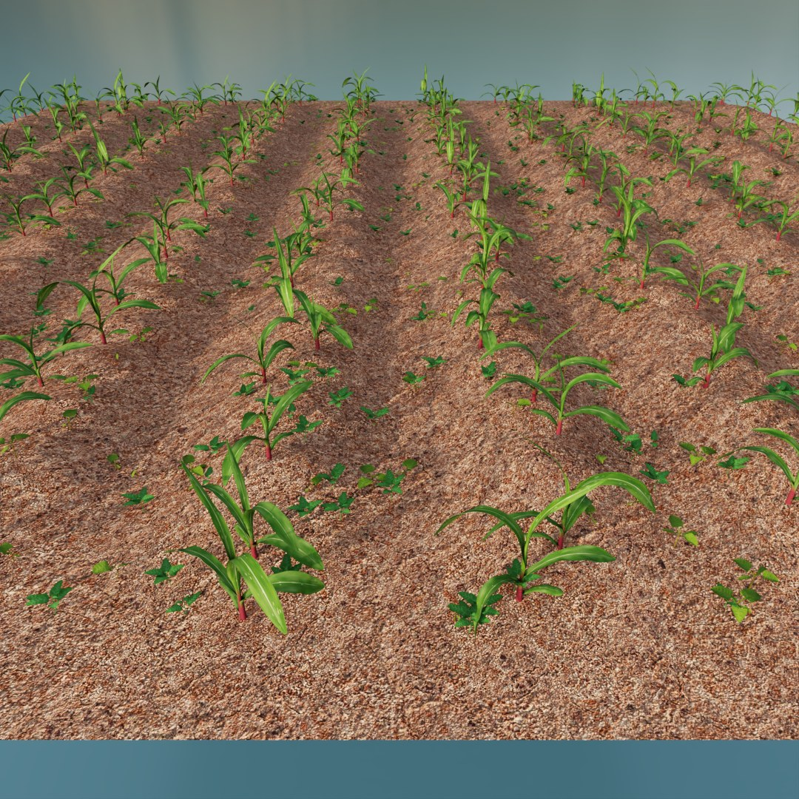
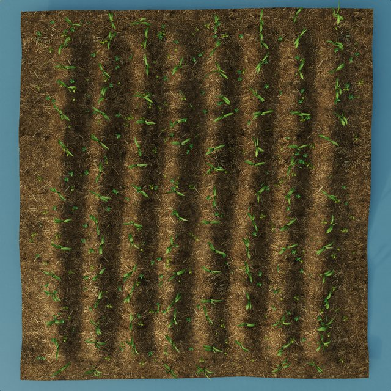
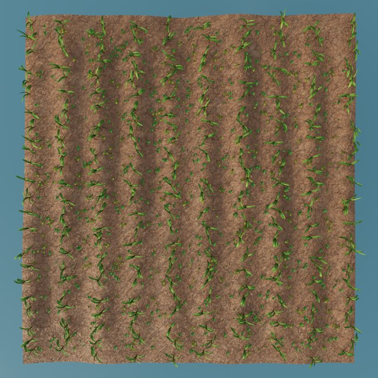
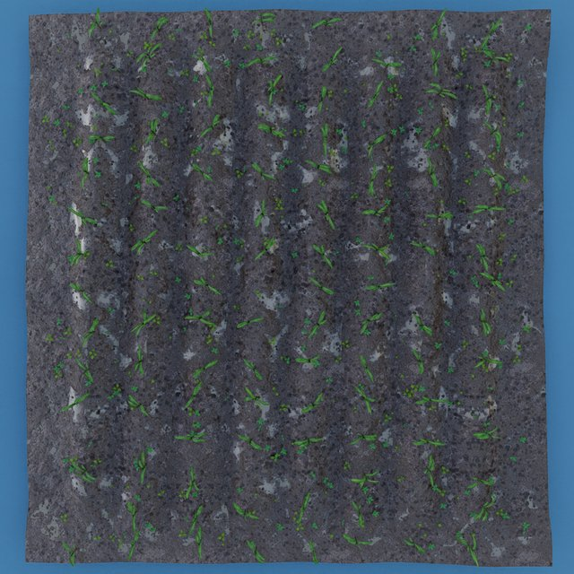
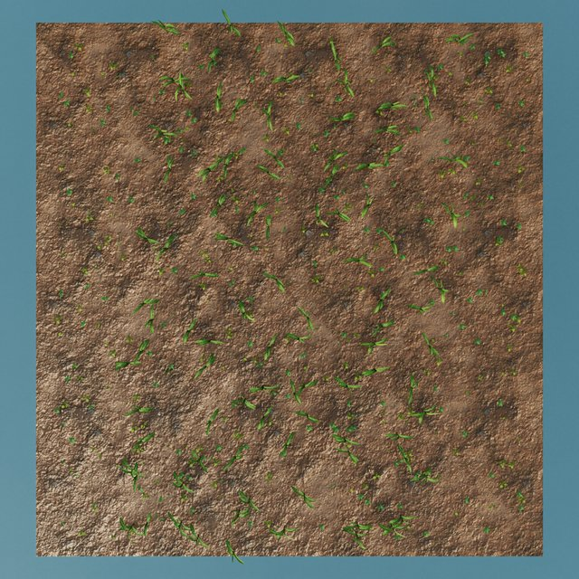
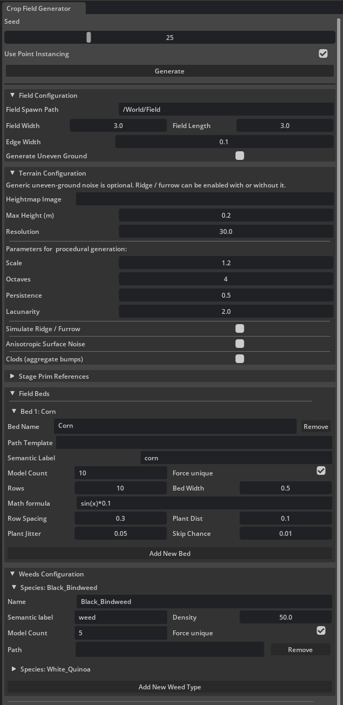
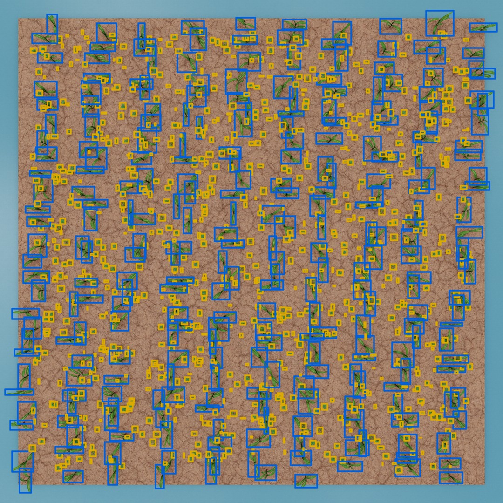

# FieldForge

An Isaac Sim extension that randomly generates agricultural fields, created for scene construction or synthetic data generation. Allows you to quickly lay out crop beds, scatter weeds and add natural randomization. Plus, the built-in Replicator tools automatically handle randomizing your lighting, ground materials, and camera angles to capture massive datasets across multiple frames.

  

## Features

* **Procedural crop beds:** Lay out multiple crop types with configurable rows, spacing, and per-plant jitter and skip chance for natural, irregular growth. Rows can be curved procedurally with a math formula.
* **Multi-species weeds:** Scatter several weed types across the field by area density (plants per square meter).
* **Procedural terrain:** Replace the flat ground with a deformed mesh driven by a heightmap or NumPy noise, plus optional additive layers for crop-row ridge/furrow, anisotropic surface roughness, and scattered soil clods.
* **Environmental randomization:** Every seed randomizes the active light (including its rotation) and the ground material (including texture offsets) to diversify scenes.
* **Two generation modes:** Fast point-instancing for rapid viewport iteration, or standard USD instancing for accurate Replicator 2D bounding boxes.
* **Replicator capture:** Automatically render N frames — incrementing the seed and repositioning the camera each frame — exporting RGB and semantic segmentation datasets.
* **Persistent configuration:** All UI settings are saved and restored automatically, and bundled sample assets let you generate a field right away.

Every seed produces a different ground material, terrain profile, and plant layout:

| | |
|:---:|:---:|
|  |  |
|  |  |

## Installation

The extension is published to the Isaac Sim Extensions registry as a community extension. In Isaac Sim, open **Window > Extensions**, switch to the **Third Party** tab, search for **FieldForge**, and enable it.

To install manually or for development, clone this repository into your Isaac Sim extensions folder and enable it from the same **Extensions** window.

It ships with sample crop and weed models and a ready-to-run default configuration, so you can generate a field immediately without preparing your own assets.

## Assets Preparation

The bundled sample assets work out of the box — this section applies only when you want to use **your own** crop, weed, ground, and lighting assets. Prepare your USD assets as follows:

* **3D Models:** Name your plant and weed variations with sequential numbers (e.g., `corn_001.usd`, `corn_002.usd`, `corn_003.usd` or `corn_01/model.usd`, `corn_02/model.usd`). Indexing starts at 1. This allows the tool to randomly pick variations using the `{num}` placeholder.
* **Ground Materials:** Place the USD materials you want to use for the ground under a single parent prim in your stage (e.g., `/World/Looks`). Make sure the material's UVs are in world space, so scaling of the ground plane does not distort the texture.
* **Lights:** Place your lights (e.g., DomeLights for the sun) under a single parent prim (e.g., `/World/Lights`).

## How to Use

  

### 1. General Controls
* **Seed:** Sets the global random state. Modifying this value generates a completely new layout, including plant placement, lighting, and material offsets.
* **Use Point Instancing:** Toggles high-performance rendering. Keep this enabled for rapid viewport iteration during scene setup. Disable it prior to capturing synthetic data (standard USD instancing is required for Replicator to generate accurate 2D bounding boxes).

### 2. Field Configuration
* **Field Spawn Path:** The target USD hierarchy path where the generated field will be constructed.
* **Field Width & Length:** Defines the overall dimensions of the ground plane in meters.
* **Edge Width:** Specifies the safe padding around the field's perimeter where no plants will spawn.

#### Terrain Configuration
* **Generate Uneven Ground:** Toggles the ground plane between a standard flat mesh and a procedurally deformed 3D terrain mesh. Using uneven ground is highly recommended for realistic synthetic data and accurate physics simulations (e.g., vehicle suspension over tractor ruts).
* **Terrain Image Path (Heightmap):** The absolute system path to a grayscale heightmap image (e.g., `.png` or `.jpg`). White pixels represent maximum height, and black pixels represent baseline zero. The generator automatically uses mirrored "ping-pong" tiling, guaranteeing a perfectly seamless landscape no matter the size of the field or the source texture. Leave this blank to use procedural noise instead.
* **Procedural Noise (Fallback):** If no image path is provided, the tool automatically generates infinitely unique, mathematically seamless rolling terrain using pure NumPy fractal value noise.
  * *Scale:* The base size of the terrain features. Lower values create tight, clustered bumps, while higher values create massive, sweeping hills.
  * *Octaves:* The number of detail layers. Higher values overlay tiny, rough details (like dirt clods) onto the larger hills.
  * *Persistence & Lacunarity:* Controls the roughness and frequency multiplier of the terrain's micro-details.
  * *Max Height:* The maximum physical height (in meters) the terrain is allowed to reach. 
* **Resolution:** Defines the physical density of the terrain mesh in vertices per meter (e.g., a resolution of `10.0` generates 100 vertices per square meter). The script automatically calculates UV coordinates based on this grid so ground materials map perfectly without stretching.

The following crop-terrain layers are additive: each can be toggled independently and stacks on top of the base ground (flat, heightmap, or procedural noise) above.

* **Simulate Ridge / Furrow:** Adds a crop-row-aligned ridge/furrow profile derived from the current bed row spacing and row-shape formula, so ridges sit exactly under the planted rows and furrows between them. Works even when generic uneven noise is disabled.
  * *Ridge Height & Furrow Depth:* The height of the row crest and the depth of the inter-row trough, in meters. Defaults are tuned for a mild early-corn field.
  * *Ridge Steepness:* Sharpness of the ridge cross-section. `1.0` is a soft cosine; higher values sharpen the crest, lower values flatten it into a plateau.
  * *Micro-Detail Strength:* Strength of the small along-ridge variation (planter/seed-opener marks at the plant spacing plus a slow crest wobble). Set to `0` for perfectly uniform ridges.
* **Anisotropic Surface Noise:** Adds directional surface roughness that is smoother along the rows and rougher across them. Combine it with the isotropic procedural noise by enabling both.
  * *Amplitude:* Root-mean-square height of the roughness in meters.
  * *Smooth Along / Across Rows:* Gaussian smoothing radii (in meters) along and across the rows. Larger values along the rows and smaller across them exaggerate the directional look.
* **Clods (aggregate bumps):** Scatters discrete soil aggregates as small Gaussian bumps across the field, adding high-frequency detail that smoothed noise cannot produce.
  * *Density:* Average number of clods per square meter. Reduce on large fields if performance drops.
  * *Min / Max Radius & Height:* Ranges (in meters) for the horizontal size and height of each clod.

### 3. Stage Prim References
* **Materials & Lights Parent Prims:** The stage paths pointing to parent prims containing your ground materials and lighting assets. The generator randomly selects one child asset from each prim per seed update.
* **Lighting Variation:** Defines the minimum and maximum rotation boundaries for the selected light source. Applies random offsets to Tilt (X-axis), Height (Y-axis), and Direction (Z-axis) to simulate varying times of day and sun positions.

### 4. Field Beds
* **Path Template:** The absolute system path to your 3D plant models. Use the `{num}` placeholder for randomized file selection (e.g., `/home/user/Crops/crop_{num:02d}/crop_{num:02d}.usd`). *Note: Asset numbering must begin at 1.*
* **Semantic Label:** The specific class name Replicator will use to tag these objects in segmentation masks (e.g., `corn`).
* **Model Count & Force Unique:** Specifies the total number of 3D asset variations available in your target folder. Enabling "Force Unique" ensures the generator cycles evenly through all available models before repeating.
* **Layout Controls:** Parameters defining the layout grid, including the number of rows, total bed width, row spacing, and longitudinal plant distance.
* **Procedural Row Shape:** Accepts a mathematical formula to curve or deform the plant rows procedurally, rather than forcing them into straight lines. The variable x represents the longitudinal distance along the row. You can use standard mathematical functions (e.g., sin, cos, sqrt) as well as random noise generators (rand() for a single random curve multiplier, or noise() for per-plant positional noise). Examples include sin(x * 0.5) * 2 for a sine wave or 0.05 * (x**2) for a parabolic arc. Leave this field blank to generate standard straight rows.
* **Jitter & Skip Chance:** Introduces natural biological variation. "Jitter" applies random X/Y positional offsets to break up perfect grids, while "Skip Chance" sets the probability of a plant failing to spawn to simulate crop loss.

### 5. Weeds Configuration
* **Name & Semantic Label:** Assigns an identifier for the weed species and its corresponding Replicator segmentation class.
* **Density:** Sets the target distribution density (weeds per square meter) across the entire field.
* **Path Template:** Functions identically to the crop bed templates, but additionally supports the `{name}` placeholder alongside `{num}`.

### 6. Replicator Capture Settings
* **Camera Prim Path:** The stage path to your render camera. If the specified path does not exist, the generator will automatically construct a default top-down camera.
* **Camera Randomization:** Configures spatial boundaries for Camera Height, Horizontal Drift (X/Y offset), and Tilt Jitter. The camera will teleport to a random coordinate within these parameters before capturing each frame.
* **Output Dir & Frames:** Defines the absolute local directory for saving datasets and the total number of frames to render.
* **Capture N Frames:** Executes the automated Replicator pipeline. The script automatically increments the global seed, repositions the camera, and exports the annotated data for each defined frame.

Each captured frame is exported with its semantic labels and 2D bounding boxes — corn and weeds tagged as separate classes, ready for training:

  

## License

This project is dual-licensed — the extension **code** is open source, while the bundled **sample assets** are provided under a separate non-commercial license.

### Code — GPL-3.0-or-later

Copyright (c) 2026 Łukasiewicz – PIT.

The extension source code is licensed under the **GNU General Public License v3.0 or later** — see the [LICENSE](LICENSE) file. You may use, modify, and redistribute it, but any distributed derivative work must also be released as open source under the same license.

### Sample assets — CC BY-NC-SA 4.0

Copyright (c) 2026 Łukasiewicz – PIT.

The sample 3D models and textures under [data/sample_models/](data/sample_models/) are licensed under **Creative Commons Attribution-NonCommercial-ShareAlike 4.0** — see [data/sample_models/LICENSE](data/sample_models/LICENSE). They are a **non-commercial preview** of a larger commercial model library, which is available separately under a commercial license. Non-commercial use only; any derivative — including images or datasets generated from these models — must stay under the same terms. For commercial use of the assets, contact Łukasiewicz – PIT.
